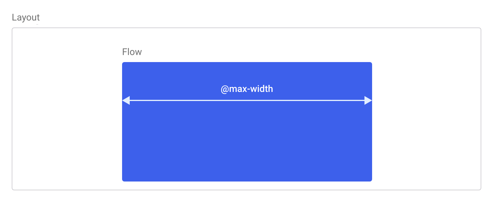
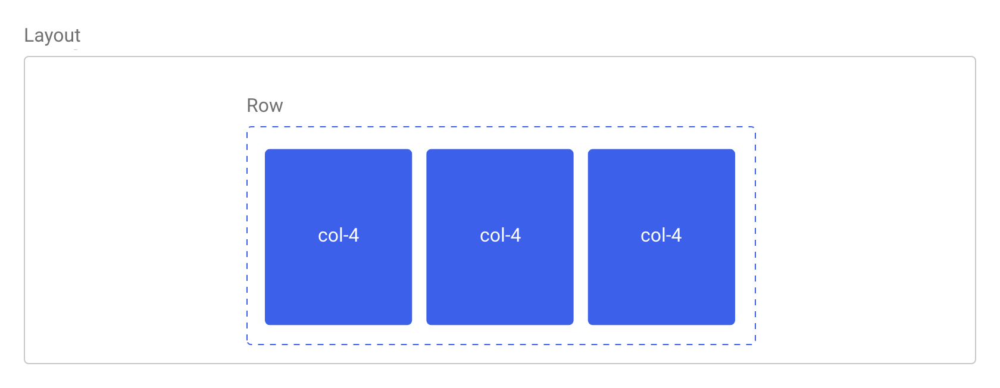
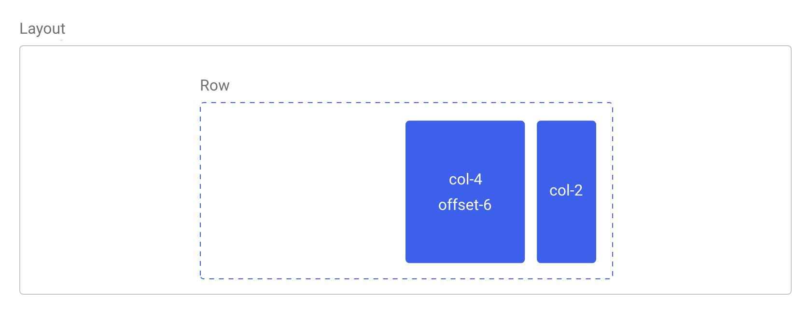
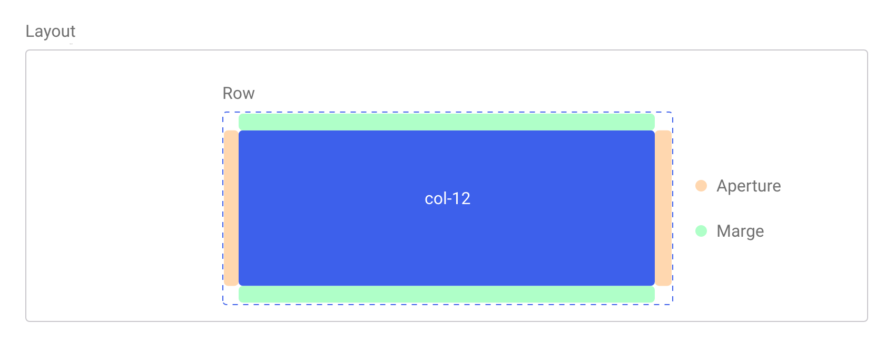

<p class="headline">Simple and basic classes to build efficent <em>macro</em> and <em>micro</em> layouts.</p>

The intent of theses classes is to provide basic styles to use on layout creation. They can either be directed uppon macro or micro layout, organising elements on the page or guiding components.

Simple as it is, this system suffice to build a basic website, but its main intent is to be extended as needed for the project at hand.

Layout can be find into the `layout/shell.less` file.

****

### Quickstart

Classes are grouped inside the `.layout()` mixin. Usualy, it will be mix to the `body`, or the root container of the design, like `.app`. Doing so, all basic sections of the document will inherit layout classes. **This mixin is mandatory when using the layout system**, even if it can be sometime bypass with namespacing.

Layout mixin take arguments that can be modified within the configuration file. Theses drive the layout behavior and the construction of components like *the grid*.

At bare minimum, Layout is initialize like so :
```` less
body {
  .layout(); // Initialize layout
}
````

Layout can take few arguments to drive its construction.

```` less
body {
  .layout(
    @max-width: @base[max-width], // 960px
    @columns-name: @base[columns-name], // .col-
    @columns-total: @base[columns-total], // 12
    @columns-halfgap: @base[columns-halfgap], // false
    @aprture: @base[aprture], // 1rem
    @marge: @base[marge], // 1rem
  );
}
````

****

### Base style

<p class="lead">Some styles are applyed directly onto the element which <code>.layout()</code> is mixed with.</p>

The root container has the following styles. It's taking the whole avaliable space with a `width` of `100%` and a `min-height` of `100vh`.

All children of the root container will have `box-sizing` set to `border-box` in order make their size include any border or padding they might have.

In order to fix a common footer problem and to properly display it at the page bottom, root container has a `display: flex` and its `flex-direction` is set to `column`. This insure to keep the default flow behavior of block succession while allowing for a nicer positionning of elements.

****

### Flow

<p class="lead">The flow is a first level container used for content. It has a fixed max width and is centered inside its parent.</p>

<figure class="figure">
  
</figure>

It is sized to the `@max-width` of the layout. It is intended to be used with base structural elements like *main* or *article*, but it may apply on other elements if needed. Within is parent, multiple flows can be appear, but they are not built to be nested.

By default, flow is centered inside it's container, usualy the **root**. However, this behavior can be overrun by adding the `.flow-uncentered` class to it.

````
<main class="flow">
  Some content…
</main>
````

Non centered flow.
````
<main class="flow flow-uncentered">
  Some non centered content…
</main>
````

****


### Row & columns

<p class="lead">The grid system uses a containers, rows and columns to organise content. It's builded over flexbox for an effective and straight forward use.</p>

<figure class="figure">
  
</figure>

A `row` is a horizontal part of the grid, here reduced to a simple `flex` element. It's a wrapper for columns. Thus, it contains multiples columns elements as direct children, themselves containing content.

A `column` is a verticlal part of the grid. They are delimited in `width`, set in `perecentages`. Meaning that they are sized relativly to their context. Whenever the sum of columns width  overpass 100% of the context width, additional columns will be stack under the firsts ones.

```` html
<div class="row">
  <div class="col-4">
    Some content…
  </div>
  <div class="col-4">
    Some content…
  </div>
  <div class="col-4">
    Some content…
  </div>
</div>
````

The total columns number is set to 12 by default. The column class name is composed of the prefix `.col-` and the number of the column size. So, each column size have it's own class, form `col-1` to `col-12`.

Columns may have a gap separating them. However, it is disabled by default. Whenever set, the gap is a numeric value added to the left and right `padding` of the column.

Following variables allow to configure the columns in the `config.less` file..

| Varibale name | Default value | Type |
| ------------- | ------------- | ---- |
| `@columns-name` | `col-` | String |
| `@columns-total` | `12` | Number  |
| `@columns-halfgap` | `false` | Number with unit or False  |

#### Offseting columns

Columns can be moved to the right with the `offset-*` classes. Theses increase the left margin of a column by * columns. Thus, `.offset-6` will push a column over six columns.

<figure class="figure">
  
</figure>


****


### Aperture & Marge

<p class="lead">Aperture and marge are positionning for elements</p>

<figure class="figure">
  
</figure>

**Aperture** is used to create a gap between elements and is set with left and right `paddings`.

**Marge** create a minimal spacing, and it set with `margin`. Margins are chosed to use their tendancy to collapse.

Aperture and Marge can be used simultaneously on any element.

```` html
<div class="row">
  <div class="col-12 aperture marge">
    Some content…
  </div>
</main>
````

Aperture and Marge can be configured with the following variables in the `config.less` file.

| Varibale name | Default value | Type |
| ------------- | ------------- | ---- |
| `@aperture` | `1rem` | Number with unit |
| `@marge` | `1rem` | Number with unit  |


****

### Interspace

An `interspace` is a simple horizontal blank space placed between two elements for spacing.

```` html
<main class="flow">
  <div>Some content…</div>
  <div class="interspace"></div>
  <div>Some content…</div>
</main>
````

### Rule

The `rule` work similarly as the `interspace` and can create a horizontal space between to blocks or containers. However, the space is materialized by a horizontal line, similar to a `hr` element.

```` html
<main class="flow">
  <div>Some content…</div>
  <div class="rule"></div>
  <div>Some content…</div>
</main>
````
